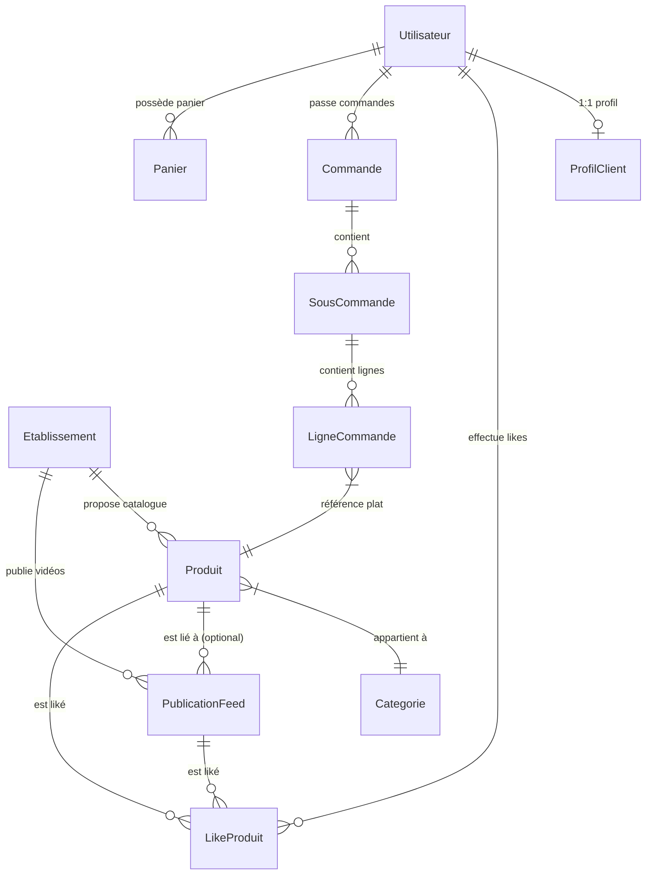
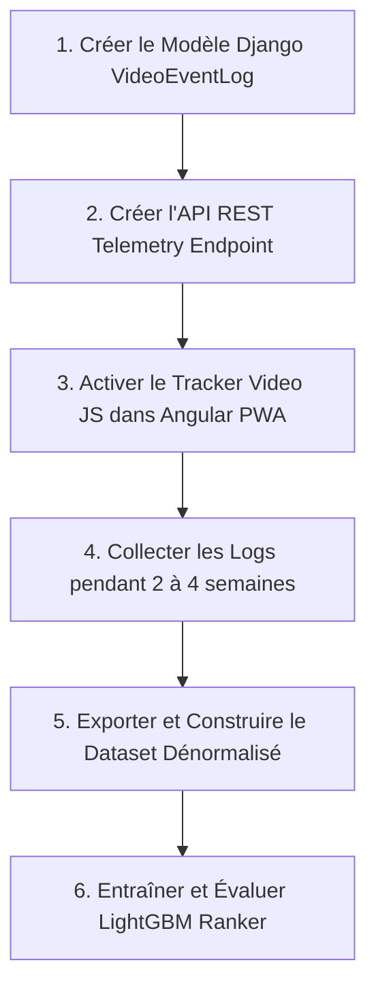

# 📊 AUDIT 2 — VALIDATION ET CARTOGRAPHIE DES DONNÉES POUR LE MOTEUR DE RECOMMANDATION IA AYYOU
**Date :** Octobre 2026  
**Auteur :** Antigravity AI Engineering Team  
**Statut Global :** ⚠️ **DONNÉES ACTUELLES PARTIELLEMENT SUFFISANTES — COLLECTE DE TÉLÉMÉTRIE INDISPENSABLE AVANT MACHINE LEARNING**  

---

## 🎯 OBJECTIF PRINCIPAL DE L'AUDIT 2

Répondre de manière stricte, factuelle et fondée uniquement sur le code source existant à la question suivante :

> **« Les données actuellement disponibles dans AYYOU permettent-elles de construire un dataset d'entraînement pertinent pour un futur modèle LightGBM Ranker de recommandation vidéo ? »**

### Réponse Synthétique :
**NON**, les données actuelles ne permettent pas de construire **immédiatement** un dataset d'entraînement supervisé complet et non biaisé pour un LightGBM Ranker. 
Bien que la **structure métier (Catalog, Plats, Établissements, Likes, Commandes)** soit parfaitement en place et exploitable pour le *Feature Engineering*, les **signaux comportementaux d'interaction implicite** (temps de visionnage, taux de complétion, skips, réécoute) sont **TOTALEMENT ABSENTS (MISSING)**.

---

## 1. 🗄️ ANALYSE DES MODÈLES DE DONNÉES EXISTANTS (DJANGO ORM)

Inspection systématique et exhaustive des modèles Django présents dans le backend `c:\Users\HP\Desktop\Ayyou-backend`.



---

### 1.1 Modèles Identité & Profils (`apps/users/models.py`)

#### Model: `Utilisateur`
- **Fichier :** `apps/users/models.py`
- **Description :** Identité centrale du système (remplace `User` Django).
- **Champs & Types :**
  - `id` : `BigAutoField` (PK)
  - `email` : `EmailField` (Unique, Indoncé)
  - `numero_telephone` : `CharField(30)` (Unique, Indexé)
  - `prenom` : `CharField(150)`
  - `nom` : `CharField(150)`
  - `est_actif` : `BooleanField`
  - `est_verifie` : `BooleanField`
  - `is_staff` : `BooleanField`
  - `mode_actif` : `CharField(20)` (`CLIENT` | `LIVREUR`)
  - `derniere_connexion` : `DateTimeField` (Null, Blank)
  - `date_creation` : `DateTimeField` (auto_now_add)
  - `date_modification` : `DateTimeField` (auto_now)
- **Relations :** 1:1 vers `ProfilClient`, N:N vers `Role` via `UtilisateurRole`.
- **Données Temporelles :** `date_creation`, `derniere_connexion`.
- **Exploitabilité Recommender :**  
  - 🟢 `date_creation` → Récence / Ancienneté du compte (Seniority feature).
  - 🟢 `derniere_connexion` → Niveau d'activité récent de l'utilisateur.

#### Model: `ProfilClient`
- **Fichier :** `apps/users/models.py`
- **Description :** Métadonnées et adresse principale du client.
- **Champs & Types :**
  - `id` : `BigAutoField` (PK)
  - `utilisateur` : `OneToOneField(Utilisateur)` (FK)
  - `photo_avatar` : `URLField`
  - `adresse_principale` : `CharField(255)`
  - `latitude` : `DecimalField(10, 7)` (Null, Blank)
  - `longitude` : `DecimalField(10, 7)` (Null, Blank)
  - `date_naissance` : `DateField` (Null, Blank)
  - `notifications_activees` : `BooleanField`
  - `date_creation` / `date_modification` : `DateTimeField`
- **Exploitabilité Recommender :**  
  - 🟡 `latitude`, `longitude` → Calcul de la distance géographique Haversine entre l'utilisateur et le restaurant. *(Nécessite d'être transmis lors de la requête API feed)*.
  - 🟢 `date_naissance` → Tranche d'âge de l'utilisateur (Age group feature).

---

### 1.2 Modèles Catalogue & Feed (`apps/catalog/models.py`)

#### Model: `Categorie`
- **Fichier :** `apps/catalog/models.py`
- **Description :** Taxonomie des plats (ex: Burgers, Plats Nationaux, Desserts).
- **Champs & Types :**
  - `id` : `BigAutoField` (PK)
  - `slug` : `SlugField(100)` (Unique, Indexé)
  - `nom` : `CharField(150)`
  - `icone` : `CharField(100)`
  - `image_url` : `URLField`
  - `est_active` : `BooleanField`
  - `ordre` : `IntegerField`
  - `date_creation` : `DateTimeField`
- **Exploitabilité Recommender :**  
  - 🟢 Feature catégorielle centrale (`category_id`) pour calculer l'affinité de l'utilisateur avec chaque spécialité culinaire.

#### Model: `Etablissement`
- **Fichier :** `apps/catalog/models.py`
- **Description :** Restaurant physique ou Vendeur à domicile.
- **Champs & Types :**
  - `id` : `BigAutoField` (PK)
  - `nom` : `CharField(200)` (Indexé)
  - `type_etablissement` : `CharField(30)` (`RESTAURANT` | `VENDEUR`)
  - `proprietaire` : `ForeignKey(Utilisateur)`
  - `adresse` : `CharField(255)`
  - `latitude` : `DecimalField(10, 7)`
  - `longitude` : `DecimalField(10, 7)`
  - `note_moyenne` : `DecimalField(3, 2)` (Default: 0.00)
  - `nombre_avis` : `IntegerField`
  - `statut` : `CharField` (`open` | `closed`)
  - `specialite` : `CharField(150)`
  - `nombre_videos` : `IntegerField`
  - `statut_verification` : `CharField` (`EN_ATTENTE`, `VALIDE`, `REFUSE`)
  - `statut_abonnement` : `CharField` (`INACTIF`, `EN_ATTENTE_PAIEMENT`, `ACTIF`, `EXPIRE`)
  - `date_expiration_abonnement` : `DateTimeField` (Indexé)
  - `date_creation` / `date_modification` : `DateTimeField`
- **Exploitabilité Recommender :**  
  - 🟢 `note_moyenne`, `nombre_avis` → Score de qualité marchand.
  - 🟢 `latitude`, `longitude` → Proximité géographique.
  - 🟢 `statut_abonnement` → Filtre métier d'éligibilité (Business constraint).

#### Model: `Produit`
- **Fichier :** `apps/catalog/models.py`
- **Description :** Plat ou produit culinaire proposé.
- **Champs & Types :**
  - `id` : `BigAutoField` (PK)
  - `etablissement` : `ForeignKey(Etablissement)`
  - `categorie` : `ForeignKey(Categorie)`
  - `nom` : `CharField(200)` (Indexé)
  - `description` : `TextField`
  - `prix_base` : `DecimalField(10, 2)` (FCFA)
  - `est_disponible` : `BooleanField`
  - `stock_disponible` / `stock_ayyou_reserve` : `IntegerField`
  - `temps_preparation` : `CharField(50)`
  - `nombre_likes` : `IntegerField`
  - `tags` : `JSONField` (Array of strings)
  - `date_creation` / `date_modification` : `DateTimeField`
- **Exploitabilité Recommender :**  
  - 🟢 `prix_base` → Sensibilité au prix du client (Price bucket feature).
  - 🟢 `categorie_id` → Segment de plat.
  - 🟢 `tags` → Embedding / Mots-clés thématiques (Spicy, Halal, FastFood).

#### Model: `PublicationFeed` (Le Média Vidéo)
- **Fichier :** `apps/catalog/models.py`
- **Description :** Contenu média vertical TikTok-style affiché sur le Feed.
- **Champs & Types :**
  - `id` : `BigAutoField` (PK)
  - `etablissement` : `ForeignKey(Etablissement)`
  - `produit` : `ForeignKey(Produit)` (Null, Blank)
  - `media_url` : `URLField(500)`
  - `cloudinary_public_id` : `CharField(255)`
  - `type_media` : `CharField(10)` (`image` | `video`)
  - `duree_video` : `CharField(20)` (ex: "0:45")
  - `max_duree_secondes` : `IntegerField` (Default: 180)
  - `nombre_likes` : `IntegerField` (Default: 0)
  - `nombre_partages` : `IntegerField` (Default: 0)
  - `date_publication` : `DateTimeField` (auto_now_add)
- **Exploitabilité Recommender :**  
  - 🟢 `date_publication` → Fraîcheur de la vidéo (Decay factor).
  - 🟢 `nombre_likes`, `nombre_partages` → Popularité globale de la vidéo.
  - 🟡 `max_duree_secondes` → Durée théorique de la vidéo (Nécessaire pour calculer le taux de complétion dès que la télémétrie sera active).

#### Model: `LikeProduit` (Seul signal explicite présent)
- **Fichier :** `apps/catalog/models.py`
- **Description :** Interaction Like entre un utilisateur et un Produit ou une PublicationFeed.
- **Champs & Types :**
  - `id` : `BigAutoField` (PK)
  - `utilisateur` : `ForeignKey(Utilisateur)`
  - `produit` : `ForeignKey(Produit)` (Null, Blank)
  - `publication` : `ForeignKey(PublicationFeed)` (Null, Blank)
  - `date_creation` : `DateTimeField` (auto_now_add)
- **Contraintes :** UniqueConstraint sur `(utilisateur, produit)` et `(utilisateur, publication)`.
- **Exploitabilité Recommender :**  
  - 🟢 **LABEL POSITIF EXPLICITE (Ground Truth)** pour construire des interactions passées $(User_i, Video_j, Target=1)$.

---

### 1.3 Modèles Commandes & Achats (`apps/orders/models.py`)

#### Model: `Panier` & `PanierItem`
- **Fichier :** `apps/orders/models.py`
- **Description :** Intentions d'achat actives non encore finalisées.
- **Exploitabilité Recommender :**  
  - 🟢 `PanierItem.produit` → Signal d'intérêt très fort (*High-intent feature*) pour les catégories actuellement dans le panier du client.

#### Model: `Commande`, `SousCommande`, `LigneCommande`
- **Fichier :** `apps/orders/models.py`
- **Description :** Historique réel des transactions financières d'achat de plats.
- **Champs Clés :**
  - `Commande.utilisateur` : FK Client
  - `Commande.total` : Montant dépensé
  - `Commande.statut` : `PAYEE`, `LIVREE`, `ANNULEE`
  - `Commande.date_creation` : Horodatage d'achat
  - `LigneCommande.produit` : FK Produit acheté
  - `LigneCommande.quantite`, `prix_unitaire`
- **Exploitabilité Recommender :**  
  - 🟢 Permet d'extraire la **matrice d'historique utilisateur** :
    - Catégories les plus souvent commandées par l'utilisateur.
    - Panier moyen habituel (Ex: 3 500 FCFA vs 12 000 FCFA).
    - Fréquence de commande et heures de préférence (Midi vs Soir).

---

### 1.4 Modèles Autres & Chatbot IA (`apps/ai/models.py`, `apps/notifications/models.py`, etc.)

- `AIChatQuota` (`apps/ai/models.py`) : Suivi du quota chatbot (7 requêtes/5h). **Non exploitable pour le ranking vidéo.**
- `Notification` (`apps/notifications/models.py`) : Logs de notifications In-App/Email. **Pas de suivi de taux de clic vidéo.**
- `Paiement` (`apps/payments/models.py`) : Statuts bancaires/Wave. **Valide les commandes réelles.**

---

## 2. 🚦 CLASSIFICATION DES DONNÉES POUR L'IA

```mermaid
graph TD
    subgraph Available ["🟢 DONNÉES DISPONIBLES ET EXPLOITABLES (40%)"]
        A1[PublicationFeed: date_publication, likes, partages]
        A2[Produit: prix_base, categorie_id, tags]
        A3[Etablissement: note, nb_avis, lat/lng, abonnement]
        A4[LikeProduit: (user_id, publication_id, date)]
    end

    subgraph Partial ["🟡 DONNÉES PARTIELLEMENT DISPONIBLES (25%)"]
        P1[Historique Commandes: Catégories achetées, Prix moyen]
        P2[Géolocalisation Client: Présente sur Profil, non transmise sur API Feed]
        P3[Session Utilisateur: User ID via JWT, mais pas de Session ID feed]
    end

    subgraph Missing ["🛑 DONNÉES TOTALEMENT ABSENTES / MISSING (35%)"]
        M1[MISSING: Temps de visionnage / watch_time en secondes]
        M2[MISSING: Taux de complétion % 25, 50, 75, 100%]
        M3[MISSING: Zappe rapide / Skip < 2s]
        M4[MISSING: Replay / Loop count]
        M5[MISSING: Impression Log / Ordre d'affichage de la vidéo]
        M6[MISSING: Clic vers Restaurant / Clic Ajout Panier depuis Vidéo]
    end
```

---

## 3. 🎯 MATRICE DES FEATURES POTENTIELLES POUR LIGHTGBM

Le tableau ci-dessous recense l'ensemble des variables (Features) utilisables pour construire le vecteur d'entrée du modèle LightGBM Ranker $X_{ij} = f(User_i, Item_j, Context)$.

| Catégorie | Nom de la Feature | Source de Données Django | Type | Statut Actuel |
| :--- | :--- | :--- | :---: | :---: |
| **User** | `user_account_age_days` | `Utilisateur.date_creation` | Numérique | ✅ Disponible |
| **User** | `user_total_orders_count` | `Commande.objects.filter(utilisateur=u).count()` | Numérique | 🟡 À agréger |
| **User** | `user_avg_order_amount` | `Commande.objects.filter(u).aggregate(Avg('total'))` | Numérique | 🟡 À agréger |
| **User** | `user_top_category_id` | Catégorie la plus achetée par l'utilisateur | Catégoriel | 🟡 À calculer |
| **User** | `user_total_likes_given` | `LikeProduit.objects.filter(utilisateur=u).count()` | Numérique | ✅ Disponible |
| **Item (Video)** | `video_age_hours` | `now() - PublicationFeed.date_publication` | Numérique | ✅ Disponible |
| **Item (Video)** | `video_total_likes` | `PublicationFeed.nombre_likes` | Numérique | ✅ Disponible |
| **Item (Video)** | `video_total_shares` | `PublicationFeed.nombre_partages` | Numérique | ✅ Disponible |
| **Item (Dish)** | `dish_price` | `Produit.prix_base` | Numérique | ✅ Disponible |
| **Item (Dish)** | `dish_category_id` | `Produit.categorie_id` | Catégoriel | ✅ Disponible |
| **Merchant** | `resto_rating` | `Etablissement.note_moyenne` | Numérique | ✅ Disponible |
| **Merchant** | `resto_reviews_count` | `Etablissement.nombre_avis` | Numérique | ✅ Disponible |
| **Merchant** | `resto_type` | `Etablissement.type_etablissement` | Catégoriel | ✅ Disponible |
| **Context** | `distance_km` | Haversine(`ProfilClient.lat/lng`, `Resto.lat/lng`) | Numérique | 🟡 Nécessite Lat/Lng API |
| **Context** | `hour_of_day` | `request_timestamp.hour` (0 à 23) | Numérique | ✅ Calculable |
| **Context** | `day_of_week` | `request_timestamp.weekday` (0 à 6) | Numérique | ✅ Calculable |
| **Implicit** | `historical_watch_time_avg` | `VideoEventLog` (Télémétrie) | Numérique | 🛑 **MISSING** |
| **Implicit** | `historical_completion_rate` | `VideoEventLog` (Télémétrie) | Numérique | 🛑 **MISSING** |
| **Implicit** | `video_skip_ratio` | `VideoEventLog` (Télémétrie) | Numérique | 🛑 **MISSING** |

---

## 4. 🏷️ DÉFINITION DU LABEL / TARGET POUR LIGHTGBM RANKER

Pour qu'un modèle **LightGBM Ranker (LambdaMART / Pairwise)** puisse apprendre à ordonner les vidéos, chaque couple $(User_i, Video_j)$ dans le dataset d'entraînement doit être associé à un **Label numérique de pertinence** $Y_{ij}$.

### Option A : Target Binaire Simplifiée (Faisable avec les données actuelles)
$$Y_{ij} = \begin{cases} 1 & \text{si l'utilisateur a Liké la vidéo (`LikeProduit` existe)} \\ 0 & \text{si l'utilisateur a vu la vidéo sans Liker (Nécessite au moins un Log d'Impression)} \end{cases}$$
- **Problème majeur :** En l'absence de logs d'impressions (savoir quelles vidéos sont apparues à l'écran), il est impossible d'identifier les exemples négatifs ($Y=0$). Affecter $Y=0$ à toutes les vidéos non likées génère un **biais massif de données non observées**.

### Option B : Target GrGraduée (Recommandée pour la cible finale AYYOU)
Une échelle de pertinence graduée de $0$ à $4$ :

| Relevance Score ($Y$) | Comportement Utilisateur (Signal) | Disponibilité Actuelle |
| :---: | :--- | :---: |
| **0 (Négatif Fort)** | Video zappée très vite (Watch time < 2 sec ou Skip) | 🛑 **MISSING** |
| **1 (Neutre)** | Video vue partiellement (< 50% de la durée) | 🛑 **MISSING** |
| **2 (Positif Implicite)** | Video vue entièrement (> 90% ou Complétion) | 🛑 **MISSING** |
| **3 (Positif Explicite)** | Video Likée (`LikeProduit`) | ✅ **DISPONIBLE** |
| **4 (Conversion Maximale)** | Clic Restaurant ou Ajout au Panier / Commande issue de la vidéo | 🟡 **PARTIEL** |

> ⚠️ **Conclusion sur la Target :** Il est **impossible de construire un Label gradué valide** sans implémenter au préalable la collecte du temps de visionnage.

---

## 5. 📋 SCHÉMA DU DATASET D'ENTRAÎNEMENT CIBLE

Voici la structure exacte sous forme de table dénormalisée d'une ligne d'entraînement (*Sample Row*) nécessaire pour alimenter LightGBM Ranker :

```text
Dataset Row Sample:
├── query_id (Group ID LightGBM) : "session_u123_20261001_1430"
├── user_id                      : "u123"
├── publication_id               : "pub_video_99"
├── target_relevance_label (Y)   : 3  (Liké = 3)
│
├── [USER FEATURES]
│   ├── user_account_age_days    : 45
│   ├── user_total_orders        : 8
│   ├── user_fav_category_id     : 4 (Burgers)
│   └── user_avg_basket_amount   : 4500.00
│
├── [ITEM / VIDEO FEATURES]
│   ├── video_recency_hours      : 12.5
│   ├── video_total_likes        : 342
│   ├── dish_price               : 3500.00
│   ├── dish_category_id         : 4 (Burgers)
│   └── resto_rating             : 4.8
│
├── [CONTEXT FEATURES]
│   ├── distance_user_resto_km   : 2.4
│   ├── request_hour             : 19 (Heure du dîner)
│   └── request_dayofweek        : 4 (Vendredi)
│
└── [IMPLICIT TELEMETRY FEATURES - ACTUELLEMENT MISSING]
    ├── watch_time_seconds       : 28.5
    ├── video_duration_seconds   : 30.0
    ├── completion_rate          : 0.95
    └── is_skipped               : 0
```

---

## 6. 🚨 LIMITES ET BIAIS DES DONNÉES ACTUELLES

1. **Absence de Rétroaction Négative (No Negative Feedback) :**
   Actuellement, AYYOU ne sait pas quelle vidéo un utilisateur n'a *pas aimée*. L'absence de Like ne signifie pas qu'une vidéo est mauvaise ; elle peut simplement n'avoir jamais été affichée à l'écran de l'utilisateur.
2. **Biais de Position (Position Bias) :**
   Le feed étant actuellement trié par `-date_publication`, les vidéos récentes reçoivent mécaniquement 100% des premières vues et des premiers likes. Si on entraîne un modèle sur ces données sans contrôler la position d'affichage, le modèle apprendra simplement à favoriser la récence.
3. **Data Sparsity (Rareté des Likes) :**
   Seule une petite minorité d'utilisateurs clique sur le bouton "Like". Baser la recommandation uniquement sur les likes ignore 90% des utilisateurs passifs qui regardent les vidéos en entier sans jamais cliquer sur "Like".

---

## 7. 🛠️ PRÉREQUIS ET FEUILLE DE ROUTE DE COLLECTE (AVANT MACHINE LEARNING)

Avant d'exécuter le moindre script d'entraînement LightGBM, la séquence d'implémentation suivante doit obligatoirement être réalisée :



### Spécification du Modèle à créer ultérieurement (`VideoEventLog`) :
*(Documenté à titre analytique — Aucune création dans cette phase)*
- `utilisateur` : ForeignKey(Utilisateur, null=True)
- `session_id` : CharField / UUID
- `publication` : ForeignKey(PublicationFeed)
- `watch_time_seconds` : FloatField
- `completion_rate` : FloatField (0.00 à 1.00)
- `est_zappe` : BooleanField (`watch_time < 2s`)
- `a_clique_resto` : BooleanField
- `a_ajoute_panier` : BooleanField
- `timestamp` : DateTimeField(auto_now_add=True)

---

## 8. 🏁 CONCLUSION DÉFINITIVE

### Question posée :
*"Les données actuellement disponibles dans AYYOU permettent-elles de construire un dataset d'entraînement pertinent pour un futur modèle LightGBM Ranker de recommandation vidéo ?"*

### Réponse officielle de l'Audit 2 :

### 🔴 **NON (Pour un entraînement immédiat)**
Les données actuelles ne contiennent pas les événements de télémétrie implicite (watch time, complétion, skips) indispensables pour définir la variable cible ($Target$) et éviter les biais d'apprentissage.

### 🟢 **OUI (À 100% au niveau de la structure et du Feature Store)**
Le schéma de base de données d'AYYOU (`Utilisateur`, `Produit`, `Etablissement`, `PublicationFeed`, `Commande`, `LikeProduit`) est particulièrement sain, propre et riche. Dès que la couche de collecte des événements de visionnage sera activée, le système disposera immédiatement de toutes les briques nécessaires pour générer un dataset d'entraînement de qualité industrielle.

---
*Fin du rapport AUDIT 2.*
