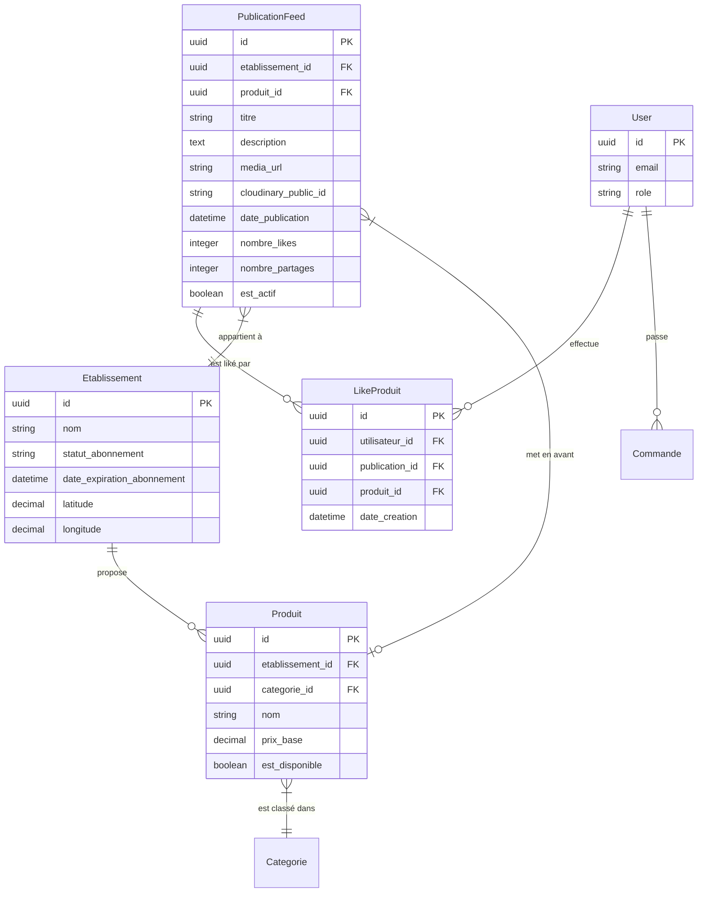
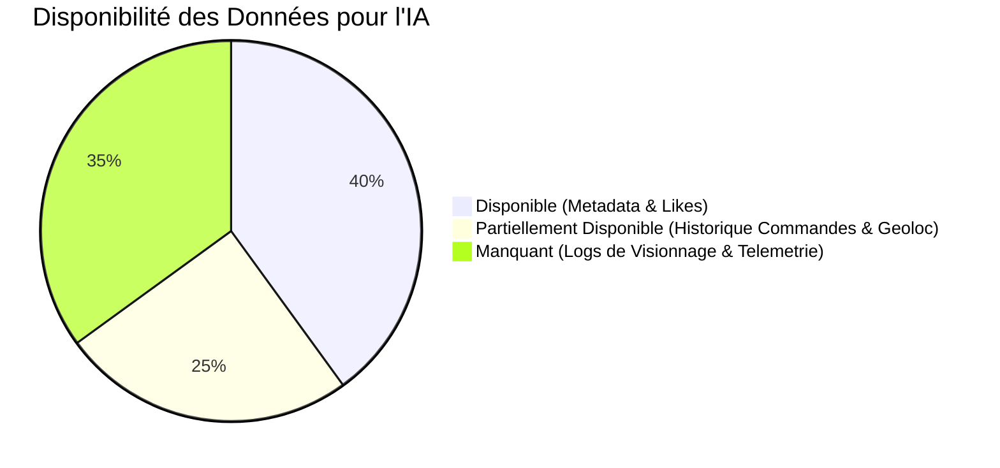
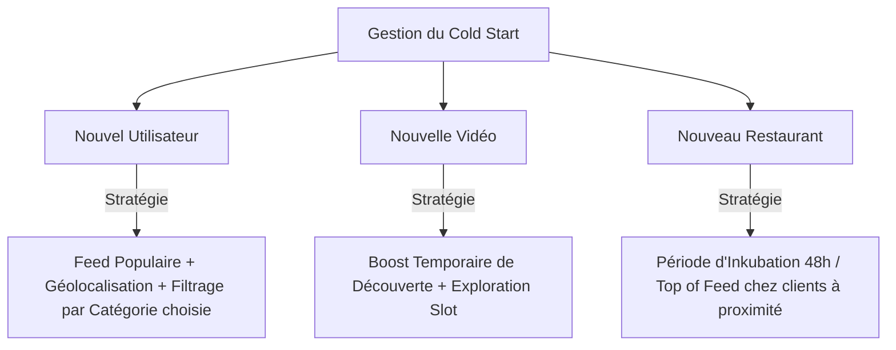
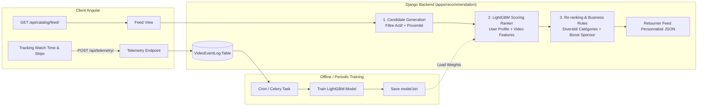

# 📋 AUDIT TECHNIQUE COMPLET DU FEED VIDÉO AYYOU
**Date :** Octobre 2026  
**Auteur :** Antigravity AI Engineering Team  
**Statut Global :** ⚠️ **PARTIELLEMENT PRÊT POUR L'IA**  

---

## 1. 🎯 EXECUTIVE SUMMARY

Le présent document constitue l'audit technique exhaustif de l'architecture actuelle du feed vidéo de l'application **AYYOU** (Frontend Angular PWA & Backend Django REST Framework). 

L'objectif de cet audit est d'évaluer la maturité technique, la structure des données et l'infrastructure de télémétrie actuelles avant l'intégration d'un **Moteur de Recommandation IA** (LightGBM Ranker / Architecture Two-Tower).

### Synthèse des constats majeurs :
1. **Logique de sélection actuelle :** Le feed est **100% statique et chronologique** (`-date_publication`). Il est identique pour tous les utilisateurs (connectés ou visiteurs). Aucune personnalisation ni segmentation n'existe à ce jour.
2. **Collecte d'événements & Télémétrie :** Seules les interactions explicites de type **Like** (`LikeProduit`) sont enregistrées en base. Les signaux d'engagement implicites (temps de visionnage en secondes, taux de complétion 25/50/75/100%, zappes rapides, réécoutes) ne sont **pas capturés ni persistés**.
3. **Maturité pour le modèle LightGBM Ranker :** **PARTIELLE**. Les métadonnées des vidéos, des plats, des restaurants et les likes sont exploitables immédiatement. Cependant, l'absence de logs de session de visionnage constitue un frein majeur au suivi des préférences réelles des utilisateurs pour l'apprentissage supervisé de l'IA.
4. **Performance & Goulots d'étranglement :** Présence d'un problème critique **N+1 SQL** dans le sérialiseur (`PublicationFeedSerializer`) pour le calcul des likes, et chargement monolithique de toutes les vidéos au lieu d'un scrolling infini avec pré-chargement dynamique.
5. **Composant Chatbot IA (`apps/ai`) :** L'assistant IA existant (Gemini API pour le support client et la recherche de plats) est **totalement indépendant** du feed vidéo. Il ne doit pas être confondu avec le futur moteur de recommandation de contenus vidéo.

---

## 2. 🏛️ ARCHITECTURE ACTUELLE DU FEED VIDÉO

```mermaid
flowchart TD
    subgraph Frontend ["Frontend (Angular PWA)"]
        HC[HomeComponent<br/>home.component.ts] -->|1. getFeed()| CDS[ClientDataService<br/>client-data.service.ts]
        HC -->|2. Observer 0.65| FPC[FoodPostComponent<br/>food-post.component.ts]
        FPC -->|3. Single Active Video| HTML5[HTML5 Video Element]
    end

    subgraph Backend ["Backend (Django REST)"]
        CDS -->|4. GET /api/catalog/feed/| URL[apps/catalog/urls.py]
        URL --> PFLV[PublicationFeedListView<br/>apps/catalog/views.py]
        PFLV -->|5. ORM Filter & Order| DB[(PostgreSQL Database)]
        PFLV -->|6. Serialize| PFS[PublicationFeedSerializer<br/>apps/catalog/serializers.py]
        PFS -->|7. N+1 Queries per item| LikeTable[(LikeProduit Table)]
    end

    subgraph Cloud ["Stockage Média"]
        PFS -.->|8. Media URL| Cloudinary[Cloudinary CDN]
    end
```

### Composition des briques techniques :
- **Frontend :** 
  - `src/app/features/client/pages/home/home.component.ts` (Gestion du flux, swipe, IntersectionObserver)
  - `src/app/features/client/components/food-post/food-post.component.html` (Lecteur HTML5 vidéo unique)
  - `src/app/core/services/client-data.service.ts` (Service HTTP vers l'API catalog)
- **Backend :**
  - `apps/catalog/views.py` (`PublicationFeedListView`)
  - `apps/catalog/serializers.py` (`PublicationFeedSerializer`)
  - `apps/catalog/models.py` (`PublicationFeed`, `LikeProduit`, `Produit`, `Etablissement`)
  - `apps/catalog/urls.py` (`/api/catalog/feed/`)

---

## 3. 🔍 LOGIQUE DE SÉLECTION & DE FILTRAGE DES VIDÉOS (CODE EXACT)

La logique d'obtention des publications du feed réside dans l'endpoint `PublicationFeedListView.get()` dans `apps/catalog/views.py`.

```python
# Extrait exact de apps/catalog/views.py

class PublicationFeedListView(APIView):
    permission_classes = [permissions.AllowAny]

    def get(self, request):
        queryset = PublicationFeed.objects.filter(
            etablissement__statut_abonnement='ACTIF',
            etablissement__date_expiration_abonnement__gt=timezone.now()
        ).order_by('-date_publication')

        paginator = StandardCatalogPagination()
        page = paginator.paginate_queryset(queryset, request)
        if page is not None:
            serializer = PublicationFeedSerializer(page, many=True, context={'request': request})
            return paginator.get_paginated_response(serializer.data)

        serializer = PublicationFeedSerializer(queryset, many=True, context={'request': request})
        return Response(serializer.data)
```

### Analyse de la logique :
1. **Filtrage Établissement (Business constraint) :** Seules les publications appartenant à un établissement ayant un abonnement **ACTIF** et non expiré (`date_expiration_abonnement > now()`) sont incluses.
2. **Tri (Hardcoded) :** `order_by('-date_publication')`. La vidéo la plus récente apparaît systématiquement en premier pour tous les utilisateurs.
3. **Sécurité & Accès :** `AllowAny`. Accessible aux utilisateurs authentifiés et anonymes.
4. **Absence de Scoring :** Aucun algorithme de pertinence, aucun poids d'interaction, aucune personnalisation vectorielle ou contextuelle.

---

## 4. 🗄️ MODÈLES DE DONNÉES ET SCHÉMA GRAPHIC



### Modèles concernés dans `apps/catalog/models.py` :
- `PublicationFeed` : Stocke le titre, la description, l'URL Cloudinary de la vidéo, le lien vers l'établissement et le produit associé, ainsi que les compteurs d'interaction globaux (`nombre_likes`, `nombre_partages`).
- `LikeProduit` : Table d'association entre l'utilisateur (`utilisateur`), la publication (`publication`) ou le produit (`produit`).
- `Etablissement` & `Produit` : Données de contexte marchand et catalogue.

---

## 5. 📊 MATRICE DES ÉVÉNEMENTS UTILISATEUR (USER EVENT MATRIX)

Pour entraîner un modèle de Recommandation IA (LightGBM Ranker / Two-Tower), il est indispensable de mesurer le degré d'intérêt implicite et explicite des utilisateurs.

| Événement Utilisateur | Capturé Actuellement ? | Emplacement / Table | Statut pour l'IA |
| :--- | :---: | :--- | :--- |
| **Like Vidéo (Explicit)** | ✅ **OUI** | Table `LikeProduit` (`publication_id`, `utilisateur_id`) | **Prêt** |
| **Unlike Vidéo (Explicit)** | ✅ **OUI** | Suppression dans `LikeProduit` | **Prêt** |
| **Clic/Ajout Panier depuis Vidéo** | 🟡 **PARTIEL** | Table `Commande` / `LigneCommande` (Sans tag source vidéo) | **À corréler** |
| **Vue Vidéo (Video Start Event)** | ❌ **NON** | Inexistant | 🛑 **Manquant** |
| **Durée de visionnage (Watch Time in sec)** | ❌ **NON** | Inexistant | 🛑 **Manquant** |
| **Taux de complétion (25%, 50%, 75%, 100%)** | ❌ **NON** | Inexistant | 🛑 **Manquant** |
| **Zappe rapide / Skip (< 2 secondes)** | ❌ **NON** | Inexistant | 🛑 **Manquant** |
| **Replay / Re-visionnage (Loop count)** | ❌ **NON** | Inexistant | 🛑 **Manquant** |
| **Clic Profil Restaurant depuis Feed** | ❌ **NON** | Navigation Angular locale (pas de log backend) | 🛑 **Manquant** |
| **Partage de Vidéo** | 🟡 **PARTIEL** | Compteur global `nombre_partages` (Pas de log par user) | 🛑 **Incomplet** |

---

## 6. 🧠 ÉTAT DE PRÉPARABILITÉ DES DONNÉES (ML DATA READINESS)



### 1. Données Disponibles (Ready for Feature Engineering) :
- **Features Contenu (Video/Item) :** `date_publication` (fraîcheur), `nombre_likes`, `nombre_partages`, `prix_base` du plat, `categorie_id` du plat, statut et informations du restaurant.
- **Features Interaction Explicite :** Matrice Utilisateurs x Publications likées (`LikeProduit`).

### 2. Données Partiellement Disponibles :
- **Historique d'Achat Utilisateur :** La table `Commande` permet de connaître les préférences culinaires passées (catégories commandées, prix moyen par commande, horaires), mais ces commandes ne sont pas explicitement attribuées à une session de visionnage vidéo.
- **Géolocalisation :** Les coordonnées GPS de l'établissement sont stockées (`latitude`, `longitude`). La position du client est récupérée côté frontend mais non transmise lors de la requête du feed.

### 3. Données Totalement Manquantes (Critical Blockers for ML) :
- **Logs de Télémétrie Vidéo (Implicit Feedback) :** Sans `watch_time` ni `completion_rate`, le modèle de recommandation ne pourra pas différencier une vidéo zappée instantanément d'une vidéo captivante regardée en entier.

---

## 7. ⚖️ TABLEAU DE FAISABILITÉ LIGHTGBM RANKER

| Feature ML | Source de Données | État Actuel | Effort d'Implémentation |
| :--- | :--- | :---: | :---: |
| **User ID / Device ID** | `request.user` / JWT | ✅ Dispo | Faible |
| **Video Recency (Hours/Days)** | `PublicationFeed.date_publication` | ✅ Dispo | Faible |
| **Video Global Popularity (Likes/Shares)** | `PublicationFeed.nombre_likes` | ✅ Dispo | Faible |
| **User Category Affinity Score** | Commandes passées + Likes | 🟡 Calculable | Moyen |
| **User Price Sensitivity (Avg Dish Price)** | Panier / Commandes | 🟡 Calculable | Moyen |
| **Distance User - Restaurant** | Haversine(User Lat/Lng, Resto Lat/Lng) | 🟡 Requiert Lat/Lng client | Moyen |
| **Video Historical Completion Rate** | Telemetry logs (Watch time / Duration) | ❌ Inexistant | **Élevé (Créer système Telemetry)** |
| **User Historical Skip Rate** | Telemetry logs (Skips < 2s) | ❌ Inexistant | **Élevé (Créer système Telemetry)** |

---

## 8. 🚨 PROBLÈMES TECHNIQUES ET DE PERFORMANCE DÉTECTÉS

### 1. Le problème N+1 SQL (Critical Backend Bottleneck)
Dans `apps/catalog/serializers.py`, pour chaque élément du feed sérialisé, la méthode `get_is_liked()` et `get_nombre_likes()` exécute **deux requêtes SQL supplémentaires distinctes**.

```python
# Code problématique dans PublicationFeedSerializer

def get_nombre_likes(self, obj):
    return obj.likes.count() # 1 requete SQL par publication

def get_is_liked(self, obj):
    request = self.context.get('request')
    if request and request.user.is_authenticated:
        return LikeProduit.objects.filter(
            utilisateur=request.user, 
            publication=obj
        ).exists() # 1 requete SQL supplémentaire par publication
    return False
```
*Impact :* Pour une page de 50 vidéos, Django exécute **101 requêtes SQL** au lieu d'une seule requête optimisée avec `annotate()` et `prefetch_related()`.

### 2. Gestion de la Pagination & Infinite Scroll
- L'API backend supporte la pagination via `StandardCatalogPagination` (page_size = 50).
- Cependant, côté Frontend (`home.component.ts`), l'application appelle `getFeed()` une seule fois au chargement et stocke tout dans le tableau `feedItems: FeedItem[]`. Il n'y a **pas d'appel dynamique pour charger la page 2** lorsque l'utilisateur s'approche de la fin du feed.

### 3. Bande Passante & Stockage Vidéo (Cloudinary)
- Les vidéos sont hébergées sur Cloudinary et diffusées via l'URL directe `media_url`.
- L'architecture Frontend actuelle dans `food-post.component.html` applique `preload="auto"` sur la vidéo active et gère la lecture/pause unique avec `IntersectionObserver` (seuil 0.65). C'est un excellent point, mais le préchargement de la vidéo suivante (next video in queue) n'est pas optimisé via adaptive streaming (HLS/DASH).

---

## 9. ❄️ ANALYSE DU COLD START (DÉMARRAGE À FROID)



1. **Nouvel Utilisateur (New User Cold Start) :**
   - *Situation :* Aucun historique de Like ni de Commande.
   - *Solution IA recommandée :* Servir un ranking basé sur la popularité globale (Hottest videos), la proximité géographique du restaurant et les préférences déclarées lors du choix de catégorie sur la landing page.
2. **Nouvelle Vidéo (New Item Cold Start) :**
   - *Situation :* 0 Like, 0 vue.
   - *Solution IA recommandée :* Stratégie **Epsilon-Greedy / Multi-Armed Bandit** (insérer 1 vidéo récente/nouvelle toutes les 5 à 7 vidéos du feed pour mesurer ses premières interactions).
3. **Nouveau Restaurant (New Merchant Cold Start) :**
   - *Situation :* Établissement venant de souscrire l'abonnement.
   - *Solution IA recommandée :* "Boost Pro" temporaire donnant un surpoids de ranking aux établissements récents dans leur zone géographique.

---

## 10. 🎯 OPTIONS ARCHITECTURALES : MODULE DJANGO VS MICROSERVICE DÉDIÉ

| Critère | Option A : Module Django Intégré (`apps/recommendation`) | Option B : Microservice Python Dédié (FastAPI / Ray) |
| :--- | :--- | :--- |
| **Complexité d'Architecture** | 🟢 **Faible** (Même repo, déploiement unique) | 🔴 **Élevée** (2 repos, synchronisation de données) |
| **Latence d'API** | 🟢 **Très Faible** (Pas d'appel HTTP inter-services) | 🟡 **Moyenne** (Overhead réseau HTTP/gRPC) |
| **Frais d'Infrastructure** | 🟢 **Inclus dans le serveur existant** | 🔴 **Coût supplémentaire** (Serveur séparé) |
| **Mise à l'échelle (Scalability)**| 🟡 Limité par le process WSGI/ASGI Django | 🟢 Indépendante & Optimisée pour GPU/CPU |
| **Recommandation pour AYYOU**| ✅ **RECOMMANDÉ (Phase 1 & 2)** | ⏳ Envisageable uniquement à fort trafic (>100k DAU) |

### Décision Stratégique :
Il est recommandé d'intégrer le moteur de recommandation sous forme d'une nouvelle application Django native : **`apps/recommendation`**. Cela évite une sur-ingénierie prématurée et permet de réutiliser directement l'ORM et la base PostgreSQL existante.

---

## 11. 📋 CHECKLIST DES MODIFICATIONS ARCHITECTURALES

```mermaid
checklist
    Existant :
        - PublicationFeedModel
        - LikeProduitModel
        - SingleActiveVideoPlayer (IntersectionObserver 0.65)
        - Auth & Etablissement Subscription Filter
    À Modifier :
        - PublicationFeedSerializer (Fix N+1 SQL)
        - GET /api/catalog/feed/ (Remplacer order_by par AI Scoring)
        - HomeComponent (Support pagination dynamique scroll)
    À Ajouter :
        - Model VideoEventLog (Télémétrie watch_time/skips)
        - API POST /api/telemetry/video-event/
        - App Django apps/recommendation (Scoring & Pipeline LightGBM)
        - Frontend Telemetry Service (Tracking JS)
    À Ne Pas Toucher :
        - UI Design & Bottom Navigation
        - Lecteur vidéo FoodPostComponent (Déjà corrigé & fonctionnel)
        - Authentification JWT
```

---

## 12. 🔮 ARCHITECTURE CIBLE (TARGET AI RECOMMENDATION PIPELINE)



---

## 13. 🤖 AUDIT DU COMPOSANT CHATBOT IA (`apps/ai`)

L'application Django contient actuellement un dossier `apps/ai/` composé des fichiers suivants :
- `apps/ai/models.py` (`AIChatQuota` : Limite à 7 requêtes par fenêtre de 5h par utilisateur).
- `apps/ai/services.py` (Intégration de l'API Google Gemini via `google-genai`).
- `apps/ai/tools.py` (Function calling pour la recherche de produits et restaurants).
- `apps/ai/views.py` & `prompts.py` (Endpoints de discussion textuelle).

### Constat Important :
Ce module IA est un **Assistant conversationnel culinaire** (LLM Chatbot). Il est totalement disjoint de la recommandation de contenu vidéo. 

> 💡 **Recommandation :** Conserver `apps/ai` pour le Chatbot et créer une application distincte `apps/recommendation` pour le moteur de recommandation vidéo (LightGBM Ranker / Two-Tower). Ne pas mélanger les LLM (texte conversationnel) et les algorithmes de Ranking Tabulaire/Vectoriel (LightGBM / Recommender Systems).

---

## 14. 🏁 CONCLUSION DE L'AUDIT & PROCHAINES ÉTAPES

### Statut Final : ⚠️ **PARTIELLEMENT PRÊT POUR L'IA**

#### Pourquoi ?
1. **Points Forts (Prêts) :** Le modèle de données catalogue est propre, la logique métier abonnement/restaurant fonctionne, et les interactions explicites (Likes) sont correctement structurées.
2. **Bloquants Majeurs à Résoudre en Priorité :**
   - Absence de système de Télémétrie Vidéo (tracking du temps de visionnage et des zappes).
   - Inexistence de logs d'entraînement pour apprendre le comportement implicite des utilisateurs.
   - Problème de performance SQL N+1 sur le feed actuel.

---

### 🚀 FEUILLE DE ROUTE RECOMMANDÉE (PLAN EN 3 PHASES)

#### Phase 1 : Télémétrie & Optimisation Infrastructure (1-2 semaines)
- [ ] Créer la table `VideoEventLog` dans le backend Django.
- [ ] Créer l'endpoint REST `POST /api/telemetry/video-event/`.
- [ ] Implémenter le tracker d'événements vidéo dans Angular (`IntersectionObserver` + calcul `watch_time` et `completion_rate`).
- [ ] Corriger le problème N+1 SQL dans `PublicationFeedSerializer`.

#### Phase 2 : Feature Store & Algorithme Heuristique (2 semaines)
- [ ] Construire les pipelines d'extraction de features (Affinité catégorie, fraîcheur vidéo, popularité).
- [ ] Mettre en place un algorithme de scoring hybride temporaire (Heuristic Ranker).
- [ ] Gérer le Cold Start (Nouveaux utilisateurs / Nouvelles vidéos).

#### Phase 3 : Modèle LightGBM Ranker & Personnalisation IA (3-4 semaines)
- [ ] Exporter le dataset d'entraînement à partir des logs de télémétrie collectés.
- [ ] Entraîner et valider le modèle **LightGBM Ranker / Pairwise LambdaMART**.
- [ ] Déployer l'inférence du modèle dans `apps/recommendation` pour servir un feed 100% personnalisé à chaque utilisateur AYYOU.

---
*Fin du rapport d'audit technique.*
