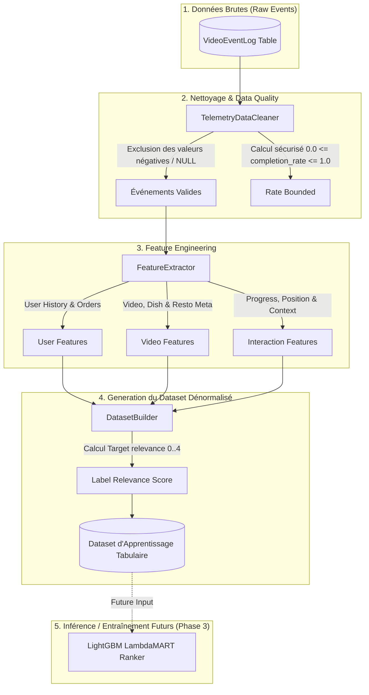

# 📊 DOCUMENTATION — PIPELINE DE DONNÉES DE RECOMMANDATION IA AYYOU

Ce document détaille l'architecture du pipeline de données de préparation des interactions vidéo et des caractéristiques métier avant l'entraînement du modèle **LightGBM Ranker**.

---

## 1. 🏗️ SCHÉMA DU PIPELINE DE DONNÉES

---

## 2. 🚦 CLASSIFICATION DES SIGNAUX COMPORTEMENTAUX ET PONDÉRATION PROPOSÉE

| Signal Événement | Description Comportementale | Degré d'Intérêt | Score Relevance Target ($Y \in [0, 4]$) |
| :--- | :--- | :---: | :---: |
| `SKIP` / Watch time < 3s | L'utilisateur a rapidement fait défiler la vidéo sans la regarder | 🔴 Très faible / Négatif | **0** |
| `PAUSE` / Vue partielle | L'utilisateur s'est arrêté brièvement ou a regardé < 50% | 🟡 Faible / Neutre | **1** |
| `COMPLETED` / Vue > 90% | L'utilisateur a regardé la vidéo quasiment jusqu'au bout | 🟢 Positif Implicite | **2** |
| `LIKE` / `SHARE` | L'utilisateur a aimé ou partagé la vidéo | 🟢 Positif Explicite | **3** |
| `CART_ADD` / `DISH_CLICK` | L'utilisateur a cliqué sur le plat ou ajouté au panier | 🔥 Conversion Maximale | **4** |

---

## 3. ❄️ GESTION DU COLD START

### 1. User Cold Start (Nouvel Utilisateur / Pas d'historique)
- *Problématique :* Pas de `user_id` enregistré ou 0 commande/like passé.
- *Stratégie proposée :* Exploitation du `session_id` pour agréger les événements de la session courante en mémoire vive + repli sur les caractéristiques globales de la vidéo (`video_total_likes`, `dish_price`, `resto_rating`).

### 2. Content Cold Start (Nouvelle Vidéo / 0 vue)
- *Problématique :* Vidéo venant d'être publiée, pas encore d'historique de télémétrie.
- *Stratégie proposée :* Utiliser les métadonnées statiques du plat et du restaurant (`dish_category_id`, `prix_base`, `resto_rating`, `video_recency_hours`).

---

## 4. 🛠️ MODULE DE PRÉPARATION (`apps/telemetry/data_preparation.py`)

- **`TelemetryDataCleaner` :** Filtre les données corrompues et garantit $0.0 \le \text{completion\_rate} \le 1.0$.
- **`FeatureExtractor` :** Extrait les vecteurs de caractéristiques dénormalisés.
- **`DatasetBuilder` :** Assemble chaque ligne d'apprentissage sous forme de dictionnaire tabulaire prêt pour la conversion en matrice d'entraînement.
