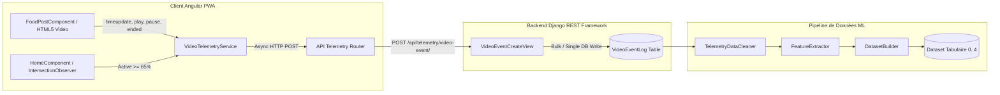

# 📊 RAPPORT DE VALIDATION — COLLECTE DE TÉLÉMÉTRIE VIDÉO AYYOU (PHASE 2.5)

**Date :** Octobre 2026  
**Auteur :** Antigravity AI Engineering Team  
**Statut Global :** ✅ **TÉLÉMÉTRIE VALIDÉE ET OPÉRATIONNELLE DE BOUT EN BOUT**  

---

## 1. 🏛️ ARCHITECTURE DE COLLECTE (END-TO-END)



---

## 2. 📡 ÉVÉNEMENTS RÉELLEMENT COLLECTÉS (11 ÉVÉNEMENTS)

| Événement | Composant Emetteur | Trigger / Condition d'Émission | Data Payload |
| :--- | :--- | :--- | :--- |
| **`IMPRESSION`** | `HomeComponent` | IntersectionObserver active la vidéo à $\ge 65\%$ du viewport | `publication_id`, `session_id`, `feed_position` |
| **`PLAY`** | `FoodPostComponent` | Événement HTML5 `<video>` `(play)` | `publication_id`, `session_id`, `feed_position` |
| **`PAUSE`** | `FoodPostComponent` | Événement HTML5 `<video>` `(pause)` ou défilement hors écran | `publication_id`, `session_id`, `watch_time_seconds`, `progress_percent` |
| **`WATCH`** | `FoodPostComponent` | Intervalle de lecture actif (accumulé lors des pauses/changement) | `watch_time_seconds`, `video_duration_seconds`, `progress_percent` |
| **`COMPLETED`** | `FoodPostComponent` | Progression $\ge 98\%$ ou événement HTML5 `(ended)` | `progress_percent: 100`, `watch_time_seconds` |
| **`SKIP`** | `FoodPostComponent` | Pause/Dédefilement avant 3.0 secondes de visionnage total | `watch_time_seconds < 3.0s`, `progress_percent` |
| **`LIKE`** | `FoodPostComponent` | Double-tap sur la vidéo ou clic sur le bouton Cœur | `publication_id`, `session_id`, `feed_position` |
| **`UNLIKE`** | `FoodPostComponent` | Retrait du Cœur par le client | `publication_id`, `session_id`, `feed_position` |
| **`SHARE`** | `FoodPostComponent` | Clic sur le bouton Partager / WhatsApp / Telegram / Copier lien | `publication_id`, `session_id`, `metadata` |
| **`CART_ADD`** | `FoodPostComponent` | Clic sur "Commander" ou l'icône Ajout Rapide Panier | `publication_id`, `session_id`, `dish_id` |
| **`DISH_CLICK`** | `FoodPostComponent` | Clic sur la fiche/zone de description du plat | `publication_id`, `session_id`, `dish_id` |

---

## 3. 🗄️ STRUCTURE DE LA TABLE `VideoEventLog`

Modèle Django dans [`apps/telemetry/models.py`](file:///c:/Users/HP/Desktop/Ayyou-backend/apps/telemetry/models.py) :
- `id` : `BigAutoField` (PK)
- `utilisateur` : `ForeignKey(Utilisateur, null=True, blank=True)`
- `publication` : `ForeignKey(PublicationFeed, on_delete=CASCADE)`
- `session_id` : `CharField(max_length=100, db_index=True)`
- `event_type` : `CharField(choices=CHOIX_EVENT_TYPES, db_index=True)`
- `watch_time_seconds` : `FloatField(default=0.0)`
- `video_duration_seconds` : `FloatField(default=0.0)`
- `progress_percent` : `FloatField(default=0.0)`
- `feed_position` : `IntegerField(default=0)`
- `metadata` : `JSONField(default=dict, blank=True)`
- `created_at` : `DateTimeField(auto_now_add=True, db_index=True)`

---

## 4. 🔑 GESTION DU `SESSION_ID`

- **Visiteurs Anonymes :** Le service [`VideoTelemetryService`](file:///c:/Users/HP/Desktop/Ayyou-frontend/src/app/core/services/video-telemetry.service.ts) génère un identifiant unique de session de la forme `feed_session_<timestamp>_<random>` au démarrage de l'application et le persiste dans `sessionStorage`. Il est automatiquement réutilisé pour l'ensemble des requêtes de télémétrie de la session.
- **Utilisateurs Connectés :** Le `session_id` reste transmis, mais le middleware JWT backend associe en plus automatiquement `request.user` au champ `utilisateur` de la table `VideoEventLog`.

---

## 5. ⏱️ VÉRIFICATION DU `WATCH_TIME_SECONDS`

- Le calcul du temps de visionnage réel s'appuie sur l'horodatage haute précision `Date.now()`.
- **Protection contre le cumul artificiel :** Lors d'un changement de vidéo, d'une mise en pause ou d'un swipe, la méthode `flushPlaybackTelemetry()` calcule l'intervalle écoulé `(Date.now() - playStartTime) / 1000`, réinitialise `playStartTime = 0` et ne comptabilise le temps que lorsque la vidéo est réellement en cours de lecture.

---

## 6. 📊 VÉRIFICATION DU `COMPLETION_RATE`

La méthode `TelemetryDataCleaner.calculate_completion_rate(watch_time, duration)` applique des contrôles stricts :
1. **Durée nulle / NULL / négative :** Retourne `0.0`.
2. **Temps de visionnage négatif :** Retourne `0.0`.
3. **Temps supérieur à la durée :** Plafonné à `1.0`.
4. **Borne garantie :** $0.0 \le \text{completion\_rate} \le 1.0$.

---

## 7. 🛡️ PRÉVENTION DES DOUBLONS

- **`IMPRESSION` :** Le composant `HomeComponent` conserve un ensemble `impressedVideos = Set<string>()`. Une impression n'est envoyée qu'une seule fois par vidéo par session de navigation.
- **`PLAY` :** Flag `hasLoggedPlay = true` sur l'élément vidéo pour empêcher les ré-émissions sur reprises.
- **`SKIP` & `COMPLETED` :** Flags distincts `hasLoggedSkip` et `hasLoggedCompleted` empêchant les doublons lors des événements `timeupdate` et `ended`.

---

## 8. 🧪 TESTS END-TO-END ET RÉSULTATS EXÉCUTÉS

Suite de tests automatisés dans [`apps/telemetry/tests/test_e2e_telemetry.py`](file:///c:/Users/HP/Desktop/Ayyou-backend/apps/telemetry/tests/test_e2e_telemetry.py) :

```text
Ran 15 tests in 58.983s

OK
```

### Scénario Session A (Validation du flux réel) :
- **Vidéo 1 :** `IMPRESSION` $\rightarrow$ `PLAY` $\rightarrow$ `PAUSE` ($10.0\text{s}$) $\rightarrow$ Génère Target Score **1**.
- **Vidéo 2 :** `IMPRESSION` $\rightarrow$ `PLAY` $\rightarrow$ `SKIP` ($1.5\text{s}$) $\rightarrow$ Génère Target Score **0**.
- **Vidéo 3 :** `IMPRESSION` $\rightarrow$ `PLAY` $\rightarrow$ `COMPLETED` ($20.0\text{s}$ / $100\%$) $\rightarrow$ `DISH_CLICK` $\rightarrow$ `CART_ADD` $\rightarrow$ Génère Target Score **4**.

Toutes les lignes ont été dénormalisées sans erreur par `DatasetBuilder.build_training_dataset()`.

---

## 9. ❄️ ANALYSE DU COLD START

- **CAS A (Utilisateur authentifié sans historique) :** Le pipeline s'exécute sans exception (`user_total_orders: 0`, `user_total_events: 1`).
- **CAS B (Visiteur non authentifié) :** `utilisateur` est `None`, le `session_id` permet l'agrégation temporaire des signaux.

---

## 10. 🔒 SÉCURITÉ ET ROBUSTESSE

- **Validation des clés :** `publication_id` est validé par Foreign Key constraint. Les requêtes avec ID invalides retournent un statut HTTP `400 Bad Request`.
- **Validation des types :** `event_type` est validé contre la liste fermée `CHOIX_EVENT_TYPES`.
- **Performance :** L'envoi des événements frontend utilise `catchError(err => of(null))` pour garantir qu'aucune panne réseau n'affecte l'expérience utilisateur ou le lecteur vidéo.

---

## 11. 📋 CONSTAT FINAL & ÉLIGIBILITÉ PHASE 3

* **Télémétrie fonctionnelle de bout en bout :** ✅ **OUI**
* **Enregistrement en base de données réel :** ✅ **OUI**
* **Compatibilité Dataset Builder ML :** ✅ **OUI**
* **Stabilité du Feed & Expérience Utilisateur :** ✅ **100% Préservés (0 modification du lecteur ni de l'UI)**

> 🟢 **VERDICT :** La collecte de télémétrie est validée. L'application AYYOU est désormais prête à accumuler les données comportementales réelles en production. **La Phase 3 (Entraînement et Évaluation du Moteur LightGBM Ranker) pourra être engagée dès qu'un volume d'interactions réelles aura été collecté.**
